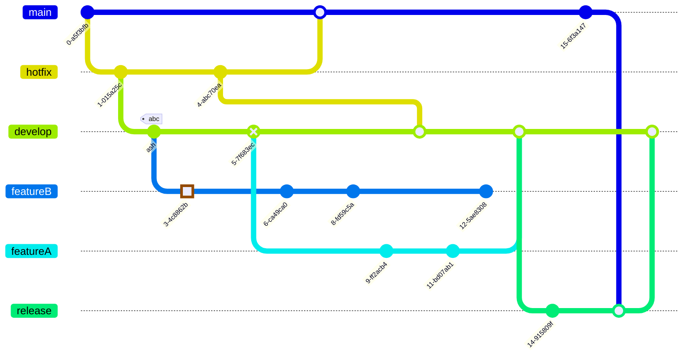
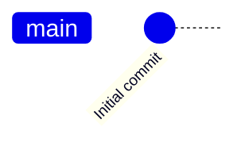
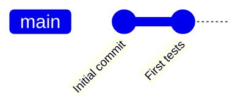
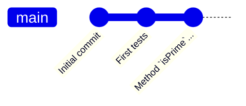
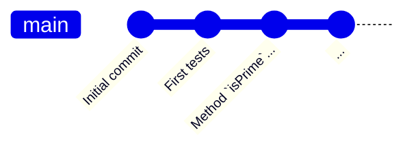
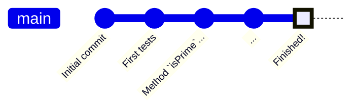

+++

title = "Introduzione a Git"
description = "Lezione introduttiva per STA-i"
outputs = ["Reveal"]
aliases = [
    "/guide/"
]

+++

##### Istituto Tecnico Tecnologico "Blaise Pascal" **@** Cesena 

# Version Control Systems: **Git**
## "**g**lobal **i**nformation **t**racker"
<small>
{}

or ~"**g**oddamn **i**diotic **t**ruckload of sh*t"~

{}
</small>

A cura di Luca Casadei, Nicholas Magi

<small>
e con il prezioso contributo di Luca Pulga
</small>

 

{}

 
 

<small class="text-muted">
    <a href="https://creativecommons.org/licenses/by-sa/4.0/">
    Copyleft 2026 — CC-BY-SA
    </a>
</small>

---

{}

## Fino ad ora - pt. 01

---

## Fino ad ora - pt. 02

---

### Fino ad ora - pt. 03

---

<i style="font-size: 15rem" class="bi bi-emoji-dizzy-fill"></i>

{}

---

# Sistemi di versionamento

{}

**Version control**, also known as source control, is the practice of tracking and managing changes to software code.

[[Atlassian - What is version control]](https://www.atlassian.com/git/tutorials/what-is-version-control)
{}

---

## Benefici principali

{}
### **#1. Tracciabilità completa**

È possibile tracciare la cronologia completa delle modifiche apportate ad un progetto.
{}

{}
### **#2. Ripristino semplice**

È possibile tornare a versioni precedenti del progetto senza causare danni collaterali.
{}

{}
### **#3. Collaborazione agevolata** 

I membri del team possono lavorare su ramificazioni diverse del progetto, così da evitare sovrapposizioni e da suddividere agilmente i compiti.
{}

---

## Tipologie di sistemi di versionamento

{}
{}
### Centralizzato
(Centralized Versioning Control System)

{}
{}
### Distribuito
(Distributed Versioning Control System)

{}
{}

---

{}
## **CVCS**

### **C**entralized **V**ersioning **C**ontrol **S**ystem

Esiste un **unico progetto centrale**, e ogni sviluppatore lavora su una copia dell'ultima versione del codice.

---

| **<u>Caratteristica</u>**        | **<u>Descrizione</u>**           |
| ------------- |:-------------|
| **Progetto centrale**      | Tutti i file di un progetto sono salvati in una località centralizzata. |
| **Storico delle versioni**      | Lo storico delle versioni del progetto è centrale (vive insieme al progetto).      |
| **Collaborazione in tempo reale** | Gli sviluppatori lavorano sulla stessa codebase, accedendo alla stessa versione del progetto e ricevendo gli stessi aggiornamenti dai colleghi.      |
| **Installazione semplice** | I CVCS sono relativamente semplici da installare e inizializzare. |

---

### CVCS Popolari

{}
{}

  
  

    <strong>Concurrent Versions System</strong>
    

        Sviluppato negli anni '80, ancora in utilizzo. Presenta alcune limitazioni critiche, risolte da sistemi sviluppati successivamente.
    

    <small class="mt-3">
       <a href="https://web.archive.org/web/20140709051732/http://ximbiot.com/cvs/manual/"> 
       Scopri di più [Documentazione ufficiale] 
       </a>
    </small>
  

{}
{}

  
  

    <strong>Apache Subversion</strong>
    

        Creato per risolvere le criticità di CVS. Server centralizzato, deve essere mantenuta una connessione costante per poter lavorare. 
    

    <small class="mt-3">
        <a href="https://subversion.apache.org/">
        Scopri di più [Documentazione ufficiale]
        </a>
    </small>
  

{}
{}

  
  

    <strong>IBM Rational ClearCase</strong>
    

        Sistema molto robusto utilizzato nelle aziende enterprise. Funzionalità avanzate per ambienti di sviluppo complessi.
    

    <small class="mt-3">
        <a href="https://www.ibm.com/docs/en/clearcase">
        Scopri di più [Documentazione ufficiale]
        </a>
    </small>
  

{}
{}
{}

---

{}

## **DVCS**

### **D**ecentralized **V**ersioning **C**ontrol **S**ystem

Ogni sviluppatore lavora su una **copia del progetto** di riferimento, disponendo sul proprio dispositivo di tutto lo storico delle modifiche di quest'ultimo. 

---

| **<u>Caratteristica</u>**        | **<u>Descrizione</u>**           |
| ------------- |:-------------|
| **Progetti completamente locali**      | Tutti i file di un progetto sono salvati in locale. Possibilità di lavorare offline. |
| **Diramazioni dello sviluppo**      | I DVCS facilitano la diramazione dello sviluppo, permettendo di lavorare in maniera isolata su una funzionalità per poi riconciliarla con la codebase principale.      |
| {} **Nessun *Single Point Of Failure*** | Se il progetto centrale dovesse essere perso, lo si può facilmente ricostruire partendo dalle copie a disposizione di chi ci stava lavorando.      |
| **Collaborazione** | I DVCS permettono, attraverso un meccanismo di *pull/push* (vedremo tra poco), una collaborazione "decentralizzata". |

---

### DVCS Popolari

{}
{}

  
  

    <strong>Mercurial</strong>
    <small class="mt-3">
       <a href="https://www.mercurial-scm.org/"> 
       Scopri di più [Documentazione ufficiale] 
       </a>
    </small>
  

{}
{}

  
  

    <strong>Git</strong>
    <small class="mt-3">
        <a href="https://git-scm.com/">
        Scopri di più [Documentazione ufficiale]
        </a>
    </small>
  

 
{}

$\uparrow$

Noi approfondiamo questo!
{}

{}
{}

  
  

    <strong>GNU Bazaar</strong>
    <small class="mt-3">
        <a href="https://documentation.help/Bazaar-help/tutorial.html">
        Scopri di più [Documentazione]
        </a>
    </small>
  

{}
{}

---

## Da qui in poi iniziamo a parlare di **Git**.

{}

---

{}

## <strong><i class="bi bi-git"></i></strong> **Git**

{}
{}

<small>

Krd (photo)Von Sprat (crop/extraction), CC BY-SA 3.0 <https://creativecommons.org/licenses/by-sa/3.0>, via Wikimedia Commons

</small>

<i class="display-3 bi bi-tux"></i>

{}
{}

- DVCS più **conosciuto** e **utilizzato**
- Software **libero** e **open-source**
- Sviluppato nell'arco di 2 settimane da **Linus Torvalds**.
    - sviluppatore, tra le altre cose, del kernel **Linux**
    - dopo uno sgradito cambio di licenza di BitWarden, sistema precedentemente utilizzato per versionare Linux

 

{}

Il nome "*Git*" non è un acronimo! In inglese, è un "insulto leggero" che Torvalds usa per descrivere sé stesso.

{}

{}
{}

---
 
Strumento che permette la collaborazione e la gestione di progetti di **tutte le dimensioni**.

 

---

## Cominciamo dalle **basi**

{}

---

## Tassonomia di Git

{}

Da ora in poi ci riferiamo al **progetto** su cui lavoriamo con il termine di **repository**. 

{}

---

Qualora, durante lo sviluppo di un progetto volessi salvarne lo stato, dovrei catturarne uno *snapshot*.

 

{}
{}

{}

Nella tassonomia di Git, ci si riferisce a questa pratica con il termine "**commit**".

{}

{}

{}

{}

{}

---

{}
## Storico di un progetto

Stiamo lavorando su un progetto all'avanguardia: 

### `PrimeSequence.kt`

---

### Step 0: Creazione di una **repository**

- Per poter permettere a `Git` di tracciare l'evoluzione di un progetto, occorre inizializzare la **repository** su cui andremo a lavorare.

 

{}
Se volessimo lavorare in CLI, scriveremmo:
`git init`
{}

 
{}

<small>

CLI $\rightarrow$ "Command Line Interface", *interfaccia a riga di comando*

</small>

{}

---

---

---

---

---

{}

---

{}
{}

## Remote

{}
{}

{}
{}

---

### Step 1: Creazione di un remote